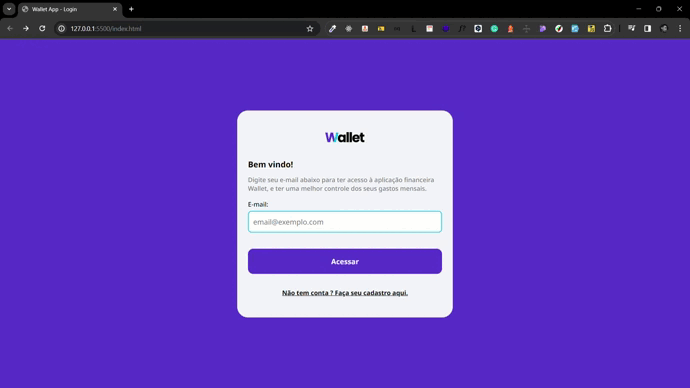

<h1 align="center" style="    max-width: 250px;
    margin: 30px 0;">
    <br>
    Wallet App.
</h1>

<p align="center">
<a href="#result">Result.</a>&nbsp;&nbsp;&nbsp;|&nbsp;&nbsp;&nbsp;
  <a href="#about-the-project">About the project.</a>&nbsp;&nbsp;&nbsp;|&nbsp;&nbsp;&nbsp;
  <a href="#live-application">Live application.</a>&nbsp;&nbsp;&nbsp;|&nbsp;&nbsp;&nbsp;
  <a href="#technologies">Technologies.</a>&nbsp;&nbsp;&nbsp;|&nbsp;&nbsp;&nbsp;
  <a href="#instructions-to-run">Instructions to run.</a>&nbsp;&nbsp;&nbsp;|&nbsp;&nbsp;&nbsp;
</p>

## Result:

  <div style="display: flex;   flex-direction: column;
  align-items: center;">
  <h1 align="center" style="display: flex; flex-direction:row;">
      
  </h1>
  </h1>
  </div>

## About the project:

This finance management dashboard is made with JavaScript, HTML, and CSS. The main objective is for the user to add and delete financial releases (saved in the API), and inform him of the balance of the month.
<br>

## Live application:

https://luannlopes.github.io/wallet-app-frontend/

## Technologies:

This application was developed with the following technologies:

- HTLM
- CSS
- JavaScript

## Instructions to run:

1. Clone the application:

```
git clone https://github.com/LuannLopes/wallet-app-frontend.git
```

2. Open the in the Explorer project and open the index.html file

```
Open the index.html file with some browser
```

3. You can create your user or use the test user:

```
teste@teste.com
```
